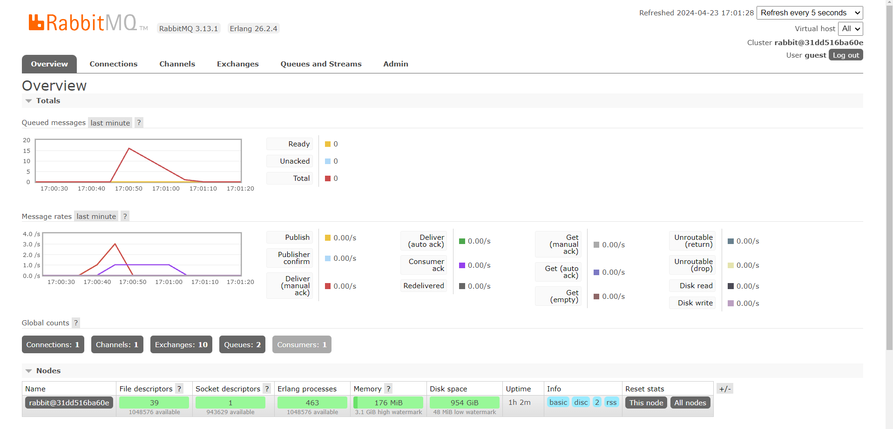
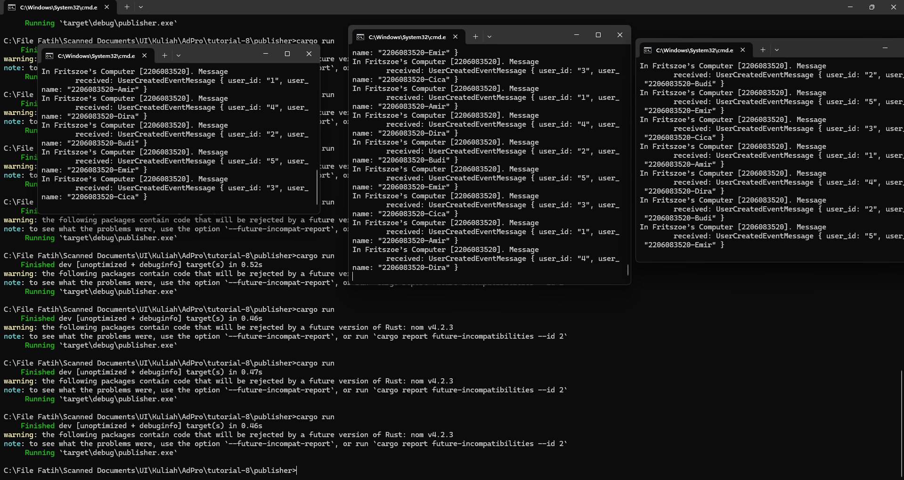
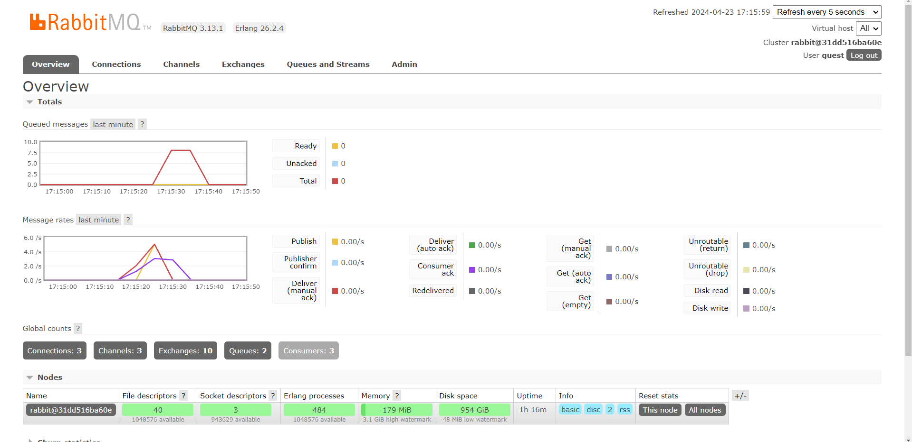

1. AMQP stands for Advanced Message Queuing Protocol. It's an open-standard messaging protocol designed for asynchronous communication between applications or components of distributed systems.

2. guest:guest usually refers to username:password, the localhost:5672 is for the machine where it's running and the 5672 is the port number

3. A screenshot showing RabbitMQ simulating slow response

4. Screenshots of the app running multiple subscribers

